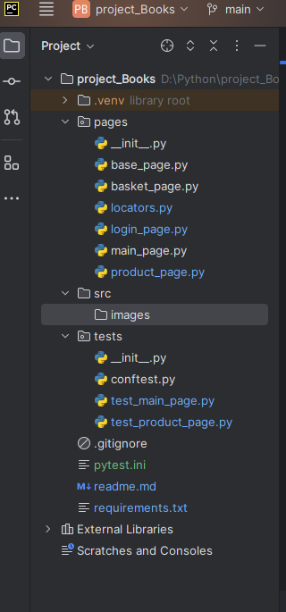

Учебный проект в рамках курса "Автоматизация тестирования с помощью Selenium и Python"
со Stepik - https://stepik.org/course/575/syllabus

В качестве выпускного задания требовалось работоспособность следющих тестов:
- 
- test_user_can_add_product_to_basket
- test_guest_can_add_product_to_basket
- test_guest_cant_see_product_in_basket_opened_from_product_page
- test_guest_can_go_to_login_page_from_product_page

Для проверки запуска и прохождения тестов необходимо 

1. скопировать себе репозиторий
2. создать и активировать виртуальное окружение
3. установить библиотеки из requirements.txt
4. вызвать в терминале команду pytest -v --tb=line --language=en -m need_review
которая запустит только тесты отмеченные маркером "need_review"

